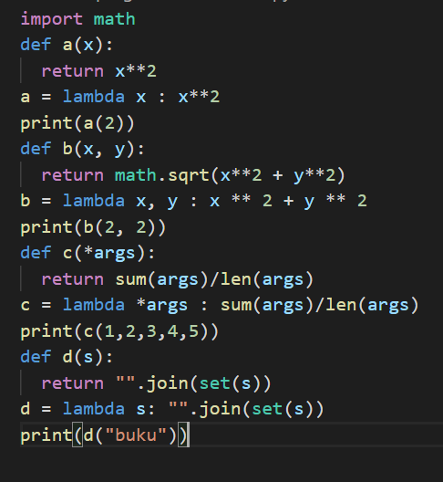
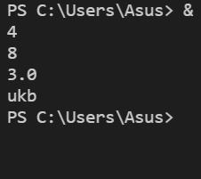
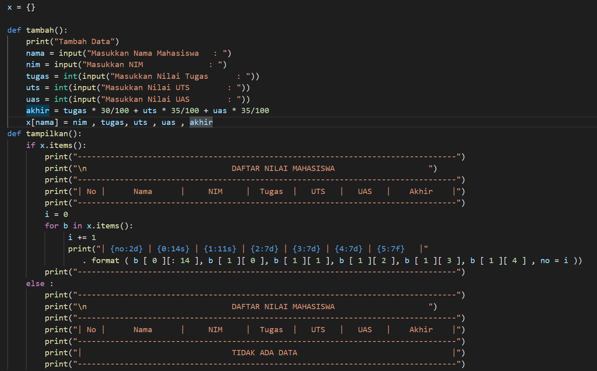
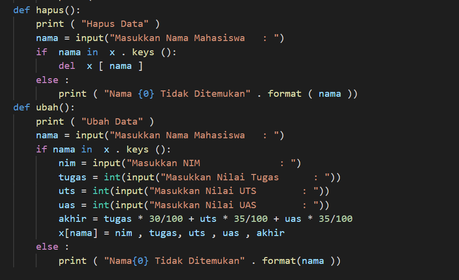
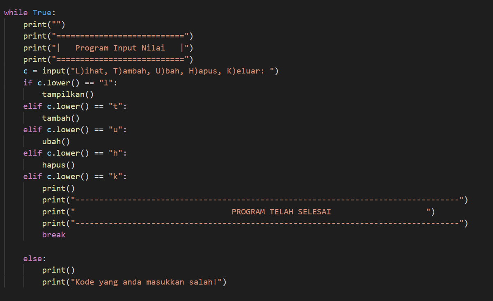
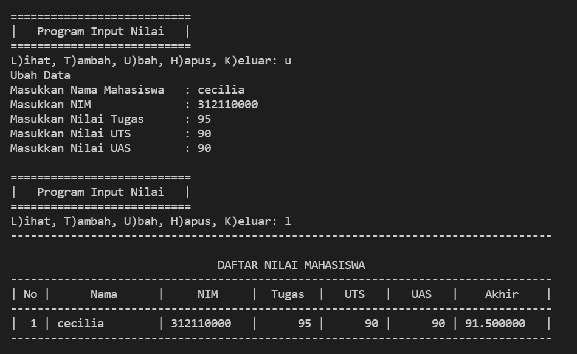
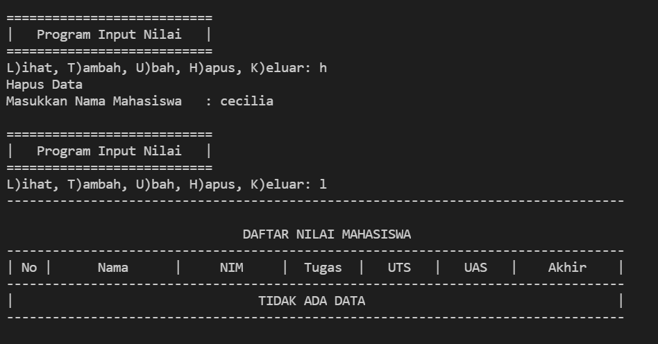

# Praktikum6

# Nama  : Cecilia Sitompul
# NIM   : 312110207
# Kelas : TI.21.C1

## Latihan

Berikut scriptnya :

outputnya :

## Praktikum

Berikut scriptnya :

keyword def digunakan sebagai awal dari sebuah fungsi
ketika kita menggunakan fungsi, maka kita tidak perlu mengulang scriptnya, cukup panggil fungsinya saja.

membuat variabel c yang isinya adalah, T)ambah, U)bah, H)apus, L)ihat, C)ari, K)eluar

Lalu user menginputkan kode

't' untuk tambah data, 'u' untuk mengubah data, 'h' untuk menghapus data, 'l' untuk melihat data dalam bentuk tabel, dan 'k' untuk keluar dari program.

jika menginput kode 't', maka user diarahkan untuk menambahkan data mahasiswa yang terdiri atas nama, nim, nilai tugas, nilai uts, nilai tugas, lalu program akan memproses dari nilai tersebut, 30% dari nilai tugas, 35% dari nilai UTS dan 35% dari nilai UAS, misalnya disini saya menambahkan data mahasiswa dengan nama Cecilia

lalu lanjut input kode 'l' untuk melihat dalam format tabel

lalu jika user menginput kode u, maka program akan mengarahkan user untuk mengubah data dengan nama siapa, setelah itu mengisi kembali nim, nilai tugas, nilai uts, dan nilai uas. maka programpun akan mengubah datanya sesuai dengan yang diinput oleh user menggunakan dictionary keys untuk mengambil seluruh kuncinya. lalu input kode l untuk melihat tabel datanya

jika user ingin menghapus data salah satu mahasiswa, user mengisi kode 'h'.program menggunakan keyword del untuk menghapus data mahasiswa. lalu user menginputkan nama mahasiswa yang datanya ingin dihapus, maka programpun akan menghapus data mahasiswa tersebut.

lalu input kode 'l' untuk melihat dalam format tabel

lalu jika user telah selesai menjalankan program, maka input kode 'k'

## Flowchart

 

## Sekian dan Terimakasih :)

